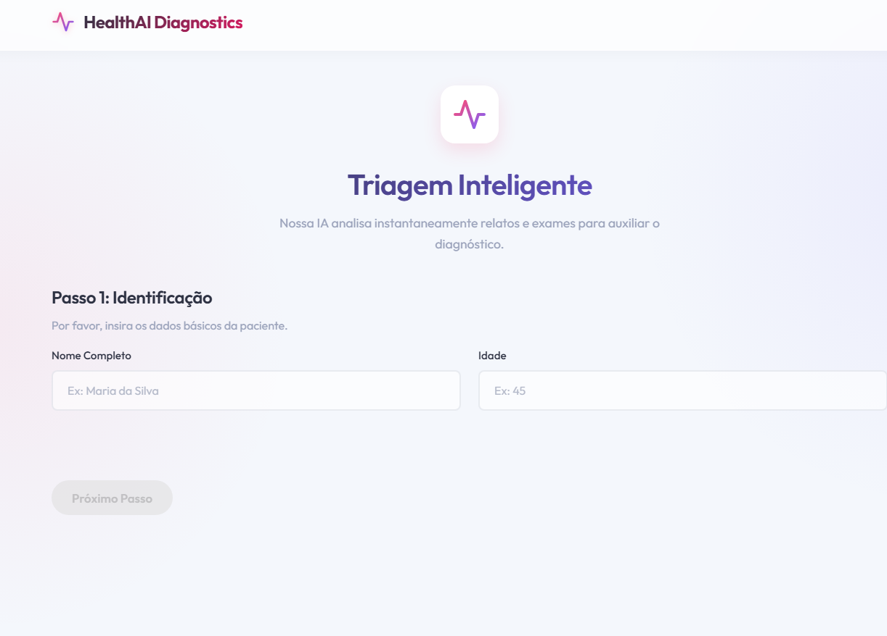
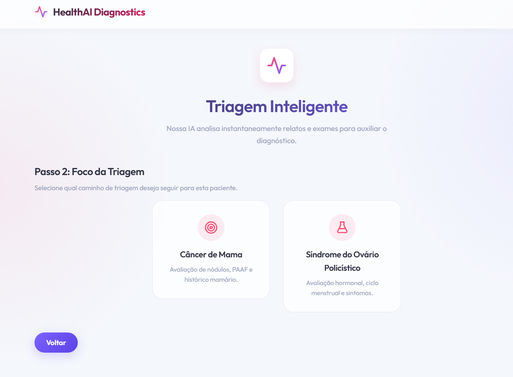
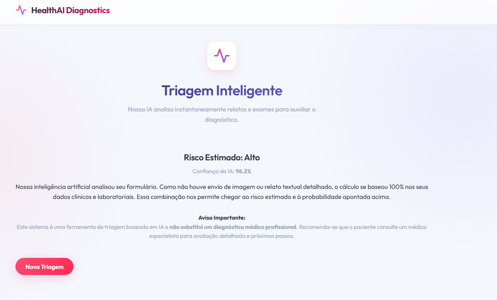
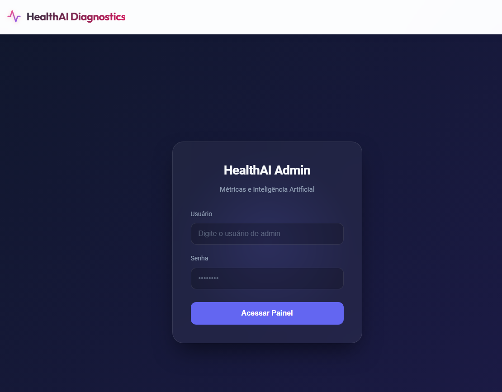
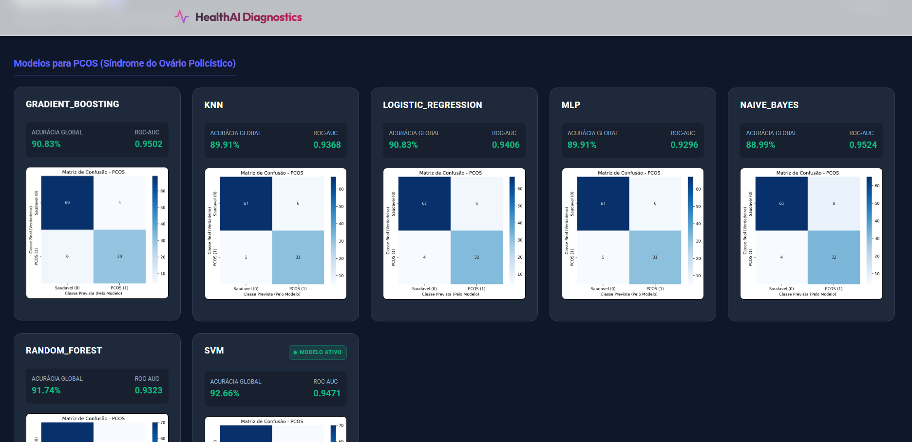
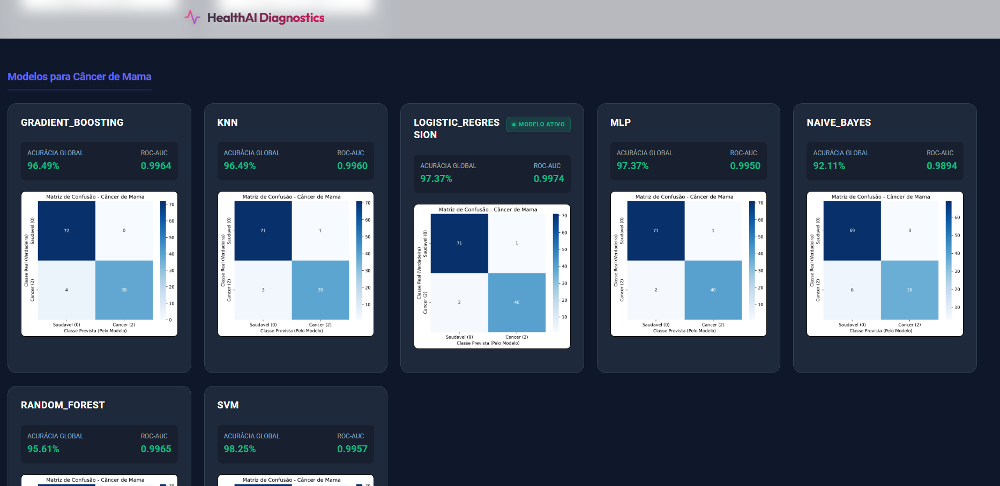
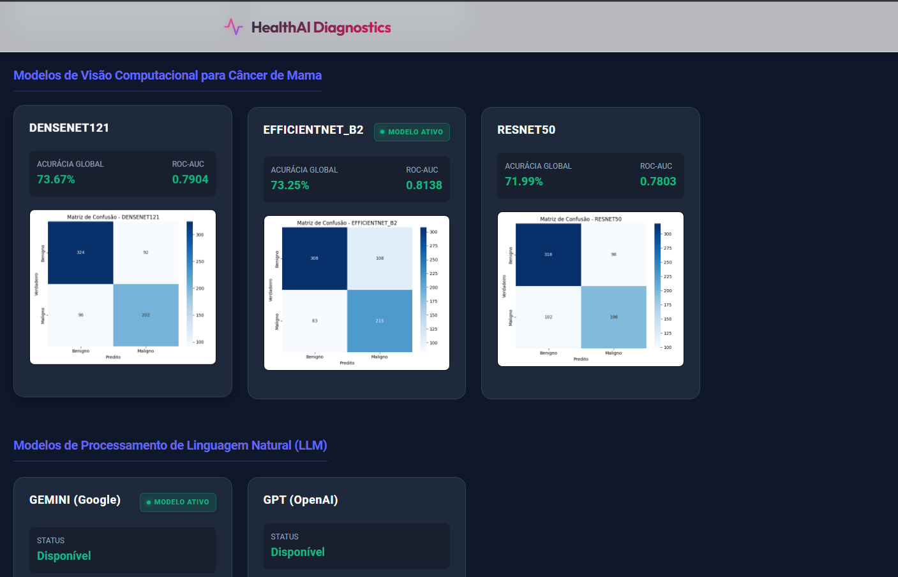
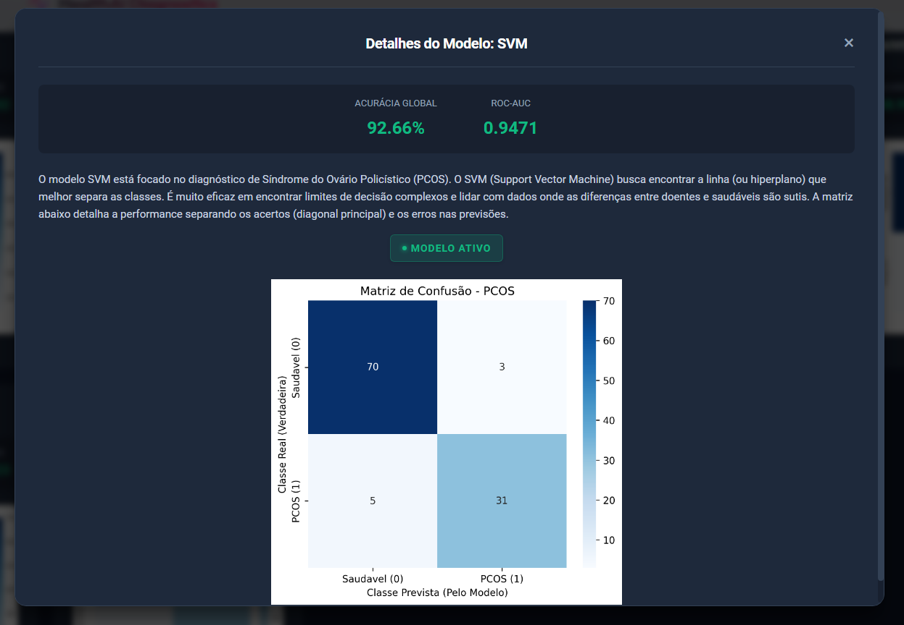

# Technical Report - Tech Challenge: Phase 1

## Introduction and Problem Definition
This project aims to perform an initial diagnosis prediction of women's health-related diseases, specifically breast cancer and polycystic ovary syndrome (PCOS).
The main goal of the project is to be made available as a tool for health professionals or for initial screenings in clinics, hospitals, or by patients before a medical consultation. With this in mind, the project does not intend to replace an analysis by a health professional, serving only as complementary support material.

The project's source code is available in a GitHub repository, which can be found by following the link [Github: Health AI](https://github.com/D4NL18/tech-challenge-health-ai). The project is in production, deployed in the cloud via the GCP platform to facilitate evaluation and use in tests, and can be visited at the link [Health AI - Prod](https://healthai-diagnostics.web.app/).

## Datasets
For the project, the datasets suggested by the activity proposal were used, namely [Polycystic ovary syndrome (PCOS)](https://www.kaggle.com/datasets/prasoonkottarathil/polycystic-ovary-syndrome-pcos) for tabular PCOS data, [Breast Cancer Wisconsin (Diagnostic) Data Set](https://www.kaggle.com/datasets/uciml/breast-cancer-wisconsin-data/data) for tabular breast cancer data, and [CBIS-DDSM: Breast Cancer Image Dataset](https://www.kaggle.com/datasets/awsaf49/cbis-ddsm-breast-cancer-image-dataset) for breast cancer image data.

## Technical Report

### Exploratory Analysis Discussions
The exploratory analysis guided the decisions on which data would be relevant for model training, the importance of each, and which would be kept, with the aim of reducing data dimensionality and making training easier and more efficient. Furthermore, anomaly detection was also performed on the datasets, such as null fields or invalid values (like #NAME?) for future data treatment.

### Pre-processing Strategies
To improve the training of the AI models, data treatment and pre-processing were performed, based on the previously conducted exploratory analysis. From this, scripts were created for the treatment of tabular data, for both PCOS and breast cancer, as well as treatment scripts for image format data also for breast cancer. The treatments of tabular data can be viewed in [backend/training_scripts/utils/data_treatment.py](https://github.com/D4NL18/tech-challenge-health-ai/blob/master/backend/training_scripts/utils/data_treatment.py), and the treatment of image data in [backend/training_scripts/utils/vision_data_treatment.py](https://github.com/D4NL18/tech-challenge-health-ai/blob/master/backend/training_scripts/utils/vision_data_treatment.py).

For data related to PCOS, errors in the spreadsheet were treated, such as "#NAME?" values which were transformed into NaN, BMI values were recalculated, and empty or low-importance columns were eliminated.

For breast cancer tabular data, a similar process was performed, containing the removal of empty or low-importance columns, with the addition of a collinearity treatment, that is, columns that correlate with each other, such as perimeter and area.

Still in `data_treatment.py`, the data treatment pipeline was created, which used `KNNImputer` for null imputation, `OutlierCapping` to remove outliers, and `StandardScaling` for data scaling. In [backend/training_scripts/utils/model_builder.py](https://github.com/D4NL18/tech-challenge-health-ai/blob/master/backend/training_scripts/utils/model_builder.py) SMOTE balancing was added to the pipeline to balance the number of positives and negatives. Also in `model_builder.py`, a function was created to separate the database into training and testing, execute the pre-processing pipeline, and perform GridSearch to identify the best hyperparameters to be used, followed by saving the model.

In [backend/training_scripts/train_all.py](https://github.com/D4NL18/tech-challenge-health-ai/blob/master/backend/training_scripts/train_all.py), the list of models that were used was initiated and the execution loop started, which used the data treatment functions and executed the Pipeline, repeating the process for each model in the list, for each of the two diseases addressed in the project.

For breast cancer image data, the pre-processing process followed a similar logic in [backend/training_scripts/utils/vision_data_treatment.py](https://github.com/D4NL18/tech-challenge-health-ai/blob/master/backend/training_scripts/utils/vision_data_treatment.py). The raw images first pass through an Auto Crop to remove the black space around the breast, avoiding useless processing. Next, the CLAHE algorithm was applied in 8x8 pixel grids. Finally, the images undergo a fixed resizing to 512x512 pixels and were converted into tensors with colors normalized to ImageNet standards.

### Models Used
The project was developed to allow the administrator user to choose which models will be used for each objective (PCOS, Breast Cancer with tabular data, and Image). Thus, an administrator panel was created with all options and the metrics provided for each model among those chosen.

The models chosen for the tabular data were Logistic Regression, Random Forest, Gradient Boosting, SVM, KNN, Naive Bayes, and MLP, due to the market's wide use and familiarity with these models, which are more popularly used. As for the computer vision models, different CNN models were used, namely Densenet121, EfficientNet-B2, and ResNet50.

The objective of this approach takes into account the continuity of training and the continuous improvement of each model. Thus, if at a given moment one model becomes better than the others, due to updates in training and the data used, it can be chosen as the main one for the application. The development was done in a standardized way for all, implying few changes in training between the models, which made this approach feasible without adding much complexity and time demand to the code. Thus, functions with specific configurations and chosen hyperparameters were developed for each model in [backend/training_scripts/models](https://github.com/D4NL18/tech-challenge-health-ai/tree/master/backend/training_scripts/models), with one file in this directory for each model. In [backend/training_scripts/train_all](https://github.com/D4NL18/tech-challenge-health-ai/blob/master/backend/training_scripts/train_all.py) and [backend/training_scripts/train_vision](https://github.com/D4NL18/tech-challenge-health-ai/blob/master/backend/training_scripts/train_vision.py), an array of models is created using the configurations for each one that were previously developed to perform the training of all simultaneously for each disease addressed. From this, the models are loaded in [backend/app/ml/tabular.py](https://github.com/D4NL18/tech-challenge-health-ai/blob/master/backend/app/ml/tabular.py) and [backend/app/ml/vision.py](https://github.com/D4NL18/tech-challenge-health-ai/blob/master/backend/app/ml/vision.py) to be used by the application.

Additionally, textual analysis was implemented using Gemini Flash 3.6, Gemini Flash 3.5, and GPT 5.6 Luna models to assist in the diagnosis, in addition to an open-source all-MiniLM-L6-v2 model used internally in the system. The choice of models is made in the same way mentioned above, where the administrator chooses to prioritize Gemini or GPT. If the user chooses Gemini, the system will try to use Flash 3.6, having Flash 3.5 and finally GPT 5.6 as a fallback. If the user chooses GPT, the reverse happens. This can be viewed in the code present in [backend/app/ml/text.py](https://github.com/D4NL18/tech-challenge-health-ai/blob/master/backend/app/ml/text.py). The models use PDF documents on breast cancer and PCOS diagnosis to support their responses and generated diagnoses. In [backend/knowledge_base/ingest_docs.py](https://github.com/D4NL18/tech-challenge-health-ai/blob/master/backend/knowledge_base/ingest_docs.py) and [backend/knowledge_base/query_rag](https://github.com/D4NL18/tech-challenge-health-ai/blob/master/backend/knowledge_base/query_rag.py), these PDFs are broken into blocks and summarized, and the all-MiniLM-L6-v2 model will help find the specific parts of each PDF that can be used for the diagnosis depending on the user's input, helping to save tokens by avoiding that all PDFs are read entirely on every user input.

To allow the union of different analysis methodologies, namely computer vision with CNN, tabular data with Machine Learning, and textual data with LLMs, the file [backend/app/ml/ensemble.py](https://github.com/D4NL18/tech-challenge-health-ai/blob/master/backend/app/ml/ensemble.py) was created, which defines the percentage that each method will have of influence on the response to the user. If tabular, textual, and image information are provided, they will represent 50%, 25%, and 25% respectively, and if any of this information is missing, its percentage will be distributed proportionally among the others. The sum of the reliability of all of them together with the percentage of influence of each one in the result will result in the reliability of the response to the user.

### Front-end, API and Deploy
For the Front-end, Angular 21 was used in the SPA pattern, with Typescript and SCSS. The backend was structured as an orchestrator of the different models and methods, where it receives HTTP requests and uses the correct models as defined by the administrator user. The deployment was done in the cloud on the GCP platform using Cloud Run and Firebase. No database was used in this project because there was no need for data persistence, since the login was done by defining a standard user in the system with the username "admin" and password "admin" to facilitate development.

## Results Obtained

#### Product Functioning
The project can be divided into two main functionalities, namely the anamnesis and diagnosis of diseases using pre-trained AI models, combined with the integration with third-party LLMs via API, and the administrator panel, accessed via login, which allows the user to change which model will be used for each evaluation, both for tabular data and images, based on the metrics obtained in the tests.

#### Anamnesis
The anamnesis home page aims to identify the user, providing name and age, as shown in figure 1 below:

In the second step, the system asks which disease the user wants to diagnose, with breast cancer and PCOS as the two options. From this, the user's flow will divide, having different inputs for each of the diseases.

For breast cancer, the system will allow the user to send numerical information about previous exams performed for diagnosis, mammography images, and an open text field, protected against prompt injection, and uses the three different methods together for identification. If one or more methods are not filled in, the system will use the others to make the diagnosis.

For PCOS, the system provides numerical and boolean inputs for prediction with tabular models, and the open field for LLMs, but does not rely on image identification.

After the triage, the system gives the diagnosis, informing the AI's confidence level, that is, how much "certainty" the AI has of a positive result. A high percentage will return a high estimated risk, while low certainty will return a low estimated risk. Furthermore, the system complements by informing how much each "type" of prediction (tabular, text, and image) represents, in percentage, in the final prediction, and warns about the need for a medical consultation to validate its results.

#### Admin
To access the administrator panel, the user must access the `/admin` route and, if not authenticated, must log in to the platform. I defined the generic user "admin" with password "admin" to facilitate tests on the platform.

Upon logging in, the user will be redirected to the panel, which displays all models, separated by objective (disease and tabular or image) with the metrics of each one (Accuracy and ROC-AUC), in addition to the confusion matrix generated in the analysis of the test results. Clicking on a model will open a modal, which displays, in addition to the previous information, basic information about the model and the button to make it active.

